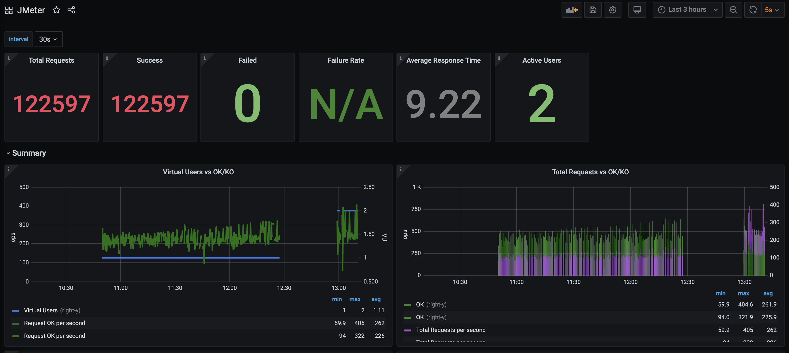
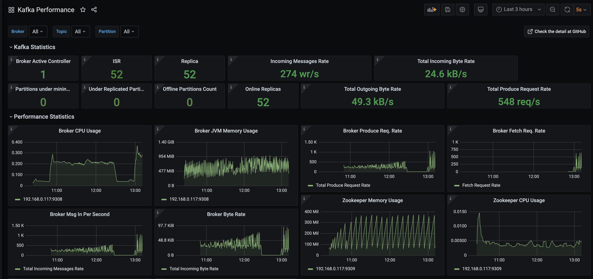
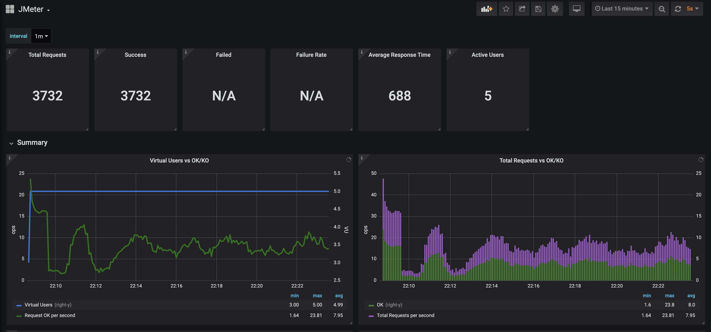

# JMeter Container for Kafka Load Testing

The container can be deployed into Docker Engine or OpenShift Container Platform. This provides a flexible JMeter container for load testing Kafka on container platform. 

## Supported Parameters

The following are the support parameters.

> For some of the possible configurable values for Kafka settings listed below, please refer to [Apache Kafka producer configuration](https://kafka.apache.org/documentation/#producerconfigs).

| Parameters                          | Description                                                                           | Default  |
| ------------------------------------|:--------------------------------------------------------------------------------------| :-----:|
|JMETER_THREADS                       | Number of JMeter threads / users                                                      | 1 |
|BOOTSTRAP_SERVERS                    | Kafka bootstrap server (bootstrap.servers)                                            | localhost:9092 |
|BATCH_SIZE                           | Kafka batch size (batch.size)                                                         | 16384 |
|LINGER_MS                            | Kafka Linger in ms (linger.ms)                                                        | 1 |
|BUFFER_MEMORY                        | Kafka Buffer memory (buffer.memory)                                                   | 33554432 |
|ACKS                                 | Kafka acks                                                                            | 1 |
|COMPRESSION_TYPE                     | Kafka Compression Type (compression.type)                                             | none |
|SEND_BUFFER                          | Kafka send buffer (send.buffer.bytes)                                                 | 131072 |
|RECEIVE_BUFFER                       | Kafka receive buffer (receive.buffer.bytes)                                           | 32768 |
|KAFKA_TOPIC                          | Kafka Topic                                                                           | jmeter-test |
|RAMUP_PERIOD                         | JMeter ramp-up perriod in seconds                                                     | 2 |
|LOOP_COUNT                           | JMeter loop count                                                                     | -1 |
|PROMETHEUS_PORT                      | JMeter Prometheus port to expose                                                      | 9270 |
|PROMETHEUS_HOST                      | JMeter Prometheus host to listen to                                                   | 127.0.0.1 |
|SAMPLER_LABEL                        | JMeter sampler label                                                                  | Kafka JSR223 |
|KAFKA_MESSAGE                        | Kafka message. The default message size is about 73 bytes. You can create your desire message with the right size manually.                                                                         | The fox is flying over the fence and the fence is trying to stop the fox. |
|THREADGROUP_SCHEDULER                | JMeter thread group scheduler a.k.a Specify Thread Lifetime.                          | false |
|THREADGROUP_DURATION                 | JMeter thread group duration in seconds. Required when THREADGROUP_SCHEDULER is true  | 0 |
|THREADGROUP_DELAY                    | JMeter thread group delay in seconds. Required when THREADGROUP_SCHEDULER is true.    | 0 |
|THREADGROUP_SAME_USER_NEXT_ITERATION | JMeter Same user on each iteration                                              | false |
|THREADGROUP_DELAYSTART               | JMeter Delay Thread creation until needed.                                      | true |
|HEAP                                 | JMeter JVM Heap size. Spaces are allowed.                                             | -Xms512m -Xmx2048m |


## Running JMeter Container with Docker Engine

Run the container:

```

docker run -p 9270:9270 -e "JMETER_THREADS=50" -e "BOOTSTRAP_SERVERS=192.168.0.117:9092" -e "PROMETHEUS_PORT=9270" -e "PROMETHEUS_HOST=0.0.0.0" -e "RAMUP_PERIOD=50" -e "LOOP_COUNT=-1" -it chengkuan/jmeter-kafka:1.0 -e "KAFKA_MESSAGE=This is my kafka message"

```

> Please refer the [supported parameters](#supported-parameters) to customize the load test.

## Running JMeter Container in OpenShift

Run the following `oc new-app` command to deploy the container into the OpenShift:

```

oc new-app --docker-image=docker.io/chengkuan/jmeter-kafka:1.0 --name=jmeter-kafka -e "JMETER_THREADS=1" -e "BOOTSTRAP_SERVERS=my-cluster-kafka-bootstrap:9092" -e "PROMETHEUS_PORT=8080" -e "PROMETHEUS_HOST=0.0.0.0" -e "RAMUP_PERIOD=120" -e "LOOP_COUNT=-1" -e "KAFKA_TOPIC=jmeter-test" -e "KAFKA_MESSAGE=This is my kafka message" -l app=jmeter -n jmeter

```

> Please refer the [supported parameters](#supported-parameters) to customize the load test.

# Quick Setup to Experience it on OpenShift

There is a [bash script](/bin/deploy.sh) included that you can use to quickly deploy and configure Red Hat AMQ Streams, Kafka Topic, Promethues and Grafana. 

Clone this repo into your local directory and ensure that the Red Hat AMQ Streams Operator is installed and ready. Run the following command from the `bin` directory to deploy the environment. 

`./deploy.sh -i`

> Refer to [This is How You Can Load Test Apache Kafka on OpenShift Container Platform Using Apache JMeter](https://braindose.blog/2021/03/11/load-test-apache-kafka-openshift-apache-jmeter/) for more details.

# Limitations

- You cannot change the test plan included without rebuild the container.
- You can only load test one Kafka Topic at a time with one container. However you can run multiple container for more one Kafka topics with each container for different topic. By running the container on OpenShift, there is no need of JMeter server for huge load test, you can basically scale to multiple PODs to increase the load test.

# List of Files

- [JMeter test plan](/testplans/kafka-jmeter-testplan.jmx) used in this project. It is built into the container.
- Grafana dashboards json files. At the moment this is written, I am using the latest version of Grafana locally but OpenShift is using an older version. I have to maintain a separate json files for different Grafana versions.
    - JMeter
        - [JMeter dashboard for OpenShift](/templates/jmeter/grafana/openshift/jmeter-dashboard.json)
        - [JMeter dashboard for lastest Grafana](/templates/jmeter/grafana/docker/jmeter-dashboard.json)
    - Kafka
        - [Kafka dashboard for OpenShift](/templates/kafka/grafana/openshift/kafka-dashboard.json)
        - [Kafka dashboard for lastest Grafana](/templates/kafka/grafana/docker/kafka-dashboard.json)
- [Sample Prometheus configuration yml file](/templates/docker-prometheus.yml). This is used if you need to run the environment locally in your PC with Promethues container.

# Development Setup

This section is meant for steps required to setup your own local development environment.

In order to do local development and test, you will need to have the following servers:

- Apache Kafka Servers
- Prometheus
- Grafana

Good to use some environmental variables for standardization. For example:

`export JMETER_HOME=~/Downloads/apache-jmeter-5.4`

`export PROJ_HOME=~/git/jmeter-container`

### Configure JMX Exporter for Kafka

This section assumes you have the Kafka servers installed.

Perform the following steps to configure the Kafka Broker and Zookeeper to expose metrics over the JMX Exporter.

1. Head to the [Prometheus JMX Exporter GitHub](https://github.com/prometheus/jmx_exporter) and follow the link provided to download the jar file.

2. Download the [sample JMX config file](https://github.com/prometheus/jmx_exporter/blob/master/example_configs/kafka-2_0_0.yml) for Kafka from Prometheus JMX Exporter GitHub.

3. You need to configure JMX Exporter in Kafka Broker & Zookeeper startup scripts. You just have to add KAFKA_OPTS line in the startup scripts of all the zookeepers and brokers as follows:

```
export KAFKA_OPTS="-javaagent:$JMETER_HOME/prometheus/prometheus_agent/jmx_prometheus_javaagent-0.12.0.jar=7073:$JMETER_HOME/prometheus/prometheus_agent/kafka-2_0_0.yml"
```

> Make sure you are using the correct paths.

> Note: Please ensure the Kafka broker configuration is with the proper advertised listener so that the Kafka client inside the JMeter container can reply properly to broker. Usually this is not an issue if hostname is resolvable to public IP. But if you running this locally for testing, the default setting will be translated into `localhost:9092` which will cause the Kafka client failed to connect back to Kafka broker when Kafka broker responses with the advertised listener. This can be changed in the `config/server.properties`.

```
advertised.listeners=PLAINTEXT://192.168.0.103:9092
```

### Running JMeter Locally

Set environmental variable:

`export JMETER_HOME=~/Downloads/apache-jmeter-5.4`

`export PROJ_HOME=~/git/jmeter-container`

Run JMeter in CLI mode with the provided test plan. 

```
$JMETER_HOME/bin/jmeter -n -p $PROJ_HOME/properties/jmeter.properties -t $PROJ_HOME/testplans/kafka-jmeter-testplan.jmx -l /tmp/kafka-jmeter-result.jtl
```

### Running Prometheus

The easiet way to run Prometheus is using Docker:

```
docker run \
    -p 9090:9090 \
    -v ~/git/jmeter-container/templates/docker-prometheus.yml:/etc/prometheus/prometheus.yml \
    prom/prometheus
```

> Make sure the path to the `docker-prometheus.yml` is correct.

The following is the sample of prometheus.yml:

```
# my global config
global:
  scrape_interval:     15s # Set the scrape interval to every 15 seconds. Default is every 1 minute.
  evaluation_interval: 15s # Evaluate rules every 15 seconds. The default is every 1 minute.
  # scrape_timeout is set to the global default (10s).

# Alertmanager configuration
alerting:
  alertmanagers:
  - static_configs:
    - targets:
      # - alertmanager:9093

# Load rules once and periodically evaluate them according to the global 'evaluation_interval'.
rule_files:
  # - "first_rules.yml"
  # - "second_rules.yml"

# A scrape configuration containing exactly one endpoint to scrape:
# Here it's Prometheus itself.
scrape_configs:
  # The job name is added as a label `job=<job_name>` to any timeseries scraped from this config.
  - job_name: 'prometheus'

    # metrics_path defaults to '/metrics'
    # scheme defaults to 'http'.

    static_configs:
    - targets: ['localhost:9090']
  - job_name: 'jmeter'
    # metrics_path defaults to '/metrics'
    # scheme defaults to 'http'.
    static_configs:
    - targets: ['192.168.0.117:9270']
  - job_name: 'kafka'
    # metrics_path defaults to '/metrics'
    # scheme defaults to 'http'.
    static_configs:
    - targets: ['192.168.0.117:9308']  
  - job_name: 'zookeeper'
    # metrics_path defaults to '/metrics'
    # scheme defaults to 'http'.
    static_configs:
    - targets: ['192.168.0.117:9309']    
```

### Run Grafana

You can use Grafana Docker container for local try out.

`docker run -d --name=grafana -p 3000:3000 grafana/grafana`

### Import the Sample Grafana Dashboard

Import the following sample dashboards for JMeter and Kafka. Please refer [List of Files](#list-of-files) for which files to import.

JMeter Grafana Dashboard



Kafka Grafana Dashboard



JMeter Grafana Dashboard on OpenShift



Kafka Grafana Dashboard on OpenShift


### To Build the JMeter Container using Docker
```
docker build -t chengkuan/jmeter-kafka:1.0 .
```
### To Build the JMeter Container using Podman
```
podman build -t chengkuan/jmeter-kafka:1.0 .
```

## Versions Used in This Project

- [Apache JMeter v5.4.1](https://downloads.apache.org//jmeter/binaries/apache-jmeter-5.4.1.tgz)
- [UBI8 openjdk-11 container image](https://catalog.redhat.com/software/containers/ubi8/openjdk-11/5dd6a4b45a13461646f677f4?gti-tabs=unauthenticated) from Red Hat.
- [Kafka Client 2.7.0](https://mvnrepository.com/artifact/org.apache.kafka/kafka-clients/2.7.0)
- [JMeter Promethues Plug-in 0.6.0](https://repo1.maven.org/maven2/com/github/johrstrom/jmeter-prometheus-plugin/0.6.0/jmeter-prometheus-plugin-0.6.0.jar)
- [Kafka JMX Exporter for Prometheus 0.15.0](https://repo1.maven.org/maven2/io/prometheus/jmx/jmx_prometheus_javaagent/0.15.0/jmx_prometheus_javaagent-0.15.0.jar)


# References

- Refer to [This is How You Can Load Test Apache Kafka on OpenShift Container Platform Using Apache JMeter](https://braindose.blog/2021/03/11/load-test-apache-kafka-openshift-apache-jmeter/) for detail explanation and steps.
- [Kafka JMX Exporter for Prometheus](https://github.com/prometheus/jmx_exporter)
- [JMeter Prometheus Plugin](https://github.com/johrstrom/jmeter-prometheus-plugin)

